# 🏨 QuickStay - Hotel Booking Platform

**QuickStay** is a full-featured hotel booking web application that allows users to search for hotels, log in securely, and manage their reservations. Hotel owners can list rooms, manage availability, and track bookings via a dedicated dashboard.


## 🚀 Live Demo

🔗 **Live Demo:** _Currently not hosted online_  
📌 To run locally, follow the instructions below.

---

## ✨ Features

- 🔍 **Smart Hotel Search** based on destination, guests, and dates
- 🔐 **Secure Authentication** using Google Sign-In via [Clerk.dev](https://clerk.dev)
- 📋 **User Dashboard** to view, pay, and manage bookings
- 🛎️ **Admin Dashboard** for adding, editing, and managing room listings
- 💳 **Stripe Payment Integration** for secure booking payments
- 📅 **Date Picker** for check-in and check-out
- 📧 **Email Confirmation** sent after successful booking
- 📱 **Fully Responsive UI** built with Tailwind CSS
- 🖼️ **Modern Design** with Lucide icons & custom SVGs

---

## 📸 Screenshots

### 🔹 Home Page
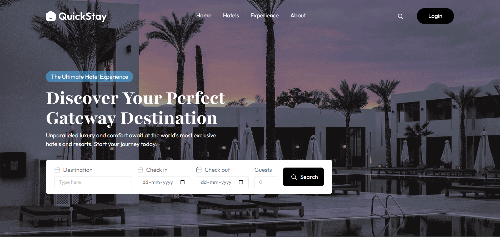

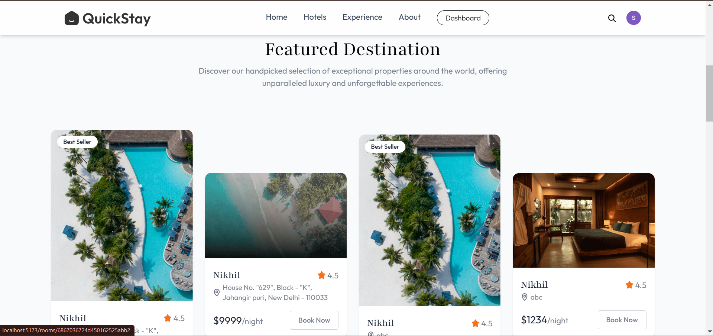

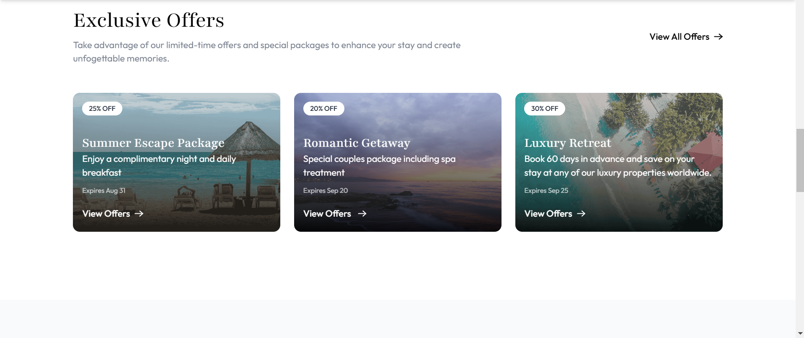

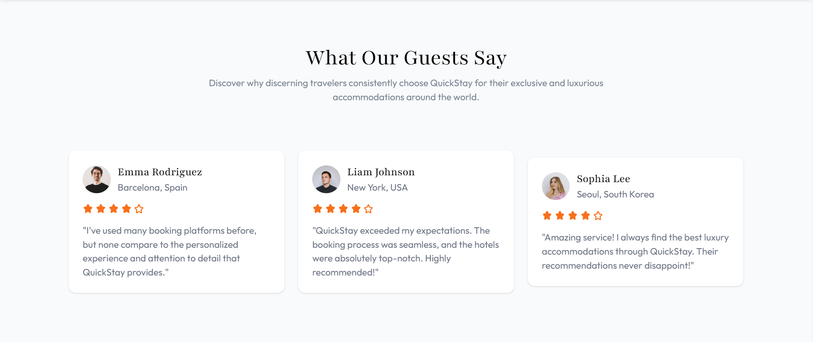

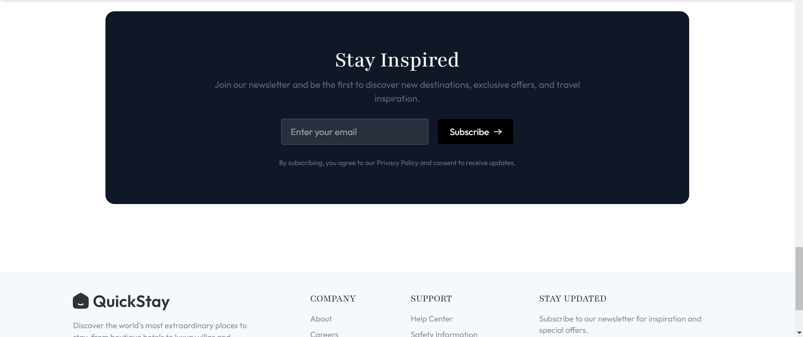

### 🔹 Google Login Popup
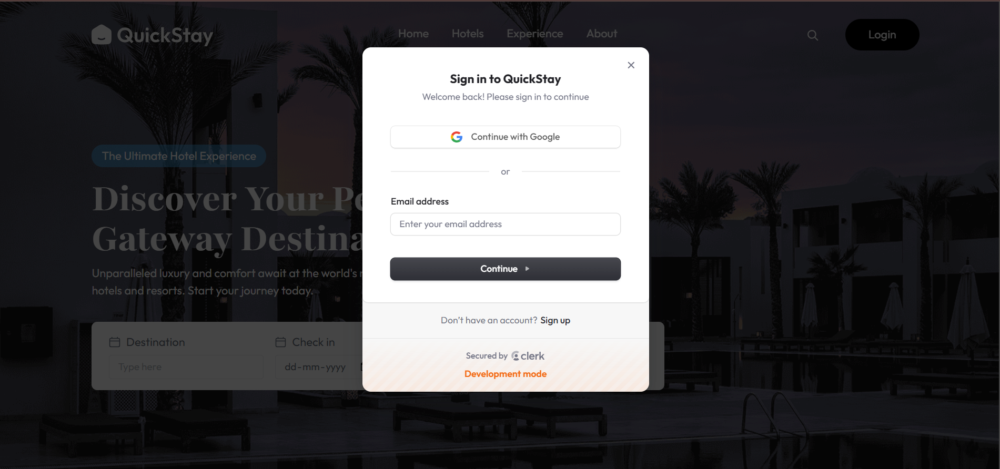

### 🔹 After login
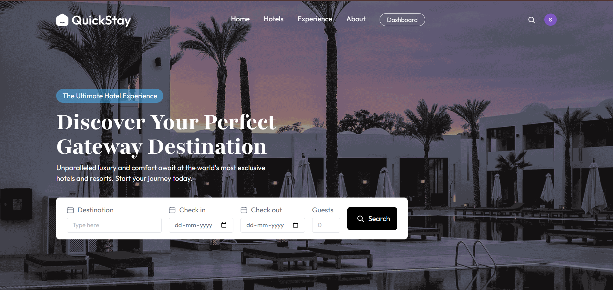

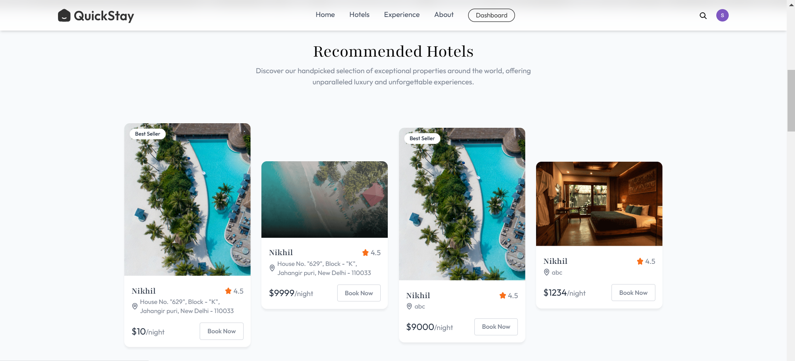

### 🔹 Dashboard (Logged In)
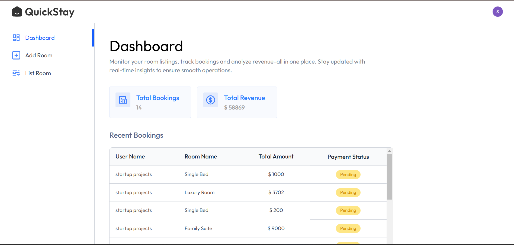

### 🔹 Admin View - Add Room
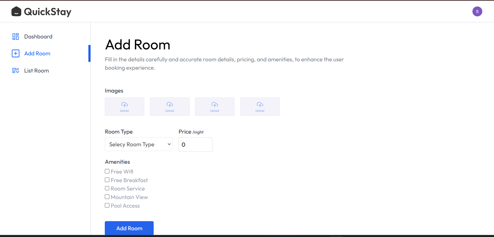

### 🔹 Bookings Page
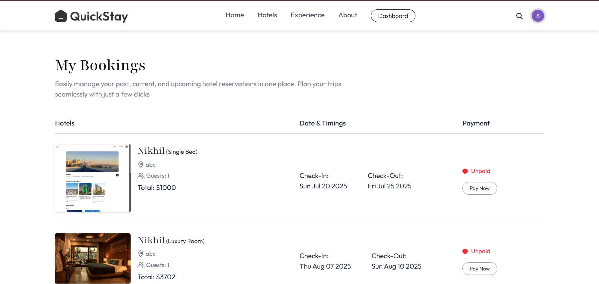

---

## 🧰 Tech Stack

### 🖥 Frontend
- React.js (Vite)
- Tailwind CSS
- Context API
- Lucide Icons & Custom SVGs

### 🔐 Authentication
- Clerk.dev (Google Sign-In, Email login)
- Stripe – for secure payment processing after booking

### 🌐 Backend
- Node.js
- Express.js
- MongoDB 
- MVC Architecture (Models, Controllers, Routes)

---

## 🛠️ How to Run Locally

```bash
# 1. Clone the repository
git clone https://github.com/your-username/quickstay.git
cd quickstay

# 2. Install frontend dependencies
cd client
npm install

# 3. Install backend dependencies
cd ../server
npm install

# 4. Setup environment variables
# Create .env files in both client/ and server/
# Add your Clerk credentials and other environment configs

# 5. Start both servers
# In client/
npm run dev

# In server/
node server.js
```
## 👨‍💼 Booking Flow
1. User visits the home page and searches for hotels.
2. Hotels are shown based on the search filters.
3. User logs in using Google or email via Clerk.
4. User selects a room, chooses dates, and proceeds to checkout.
5. User pays securely via Stripe.
6. A confirmation email is sent to the user.
7. User can view and manage bookings from their dashboard.
8. Admin can manage room listings via the admin panel.

## 🗂 Folder Structure
```
quickstay/
├── client/
│   ├── public/
│   ├── src/
│   │   ├── assets/
│   │   ├── components/
│   │   ├── context/
│   │   ├── pages/
│   │   ├── App.jsx
│   │   ├── main.jsx
│   │   └── index.css
│   ├── .env
│   ├── index.html
│   ├── vite.config.js
│   └── package.json
│
├── server/
│   ├── configs/
│   ├── controllers/
│   ├── middleware/
│   ├── models/
│   ├── routes/
│   ├── .env
│   ├── server.js
│   └── package.json
```
## 🔮 Future Improvements

1. Room availability calendar
2. Google Maps for hotel locations
3. Admin analytics dashboard
4. User reviews and ratings
5. Multi-language support
6. Mobile app version (React Native)
